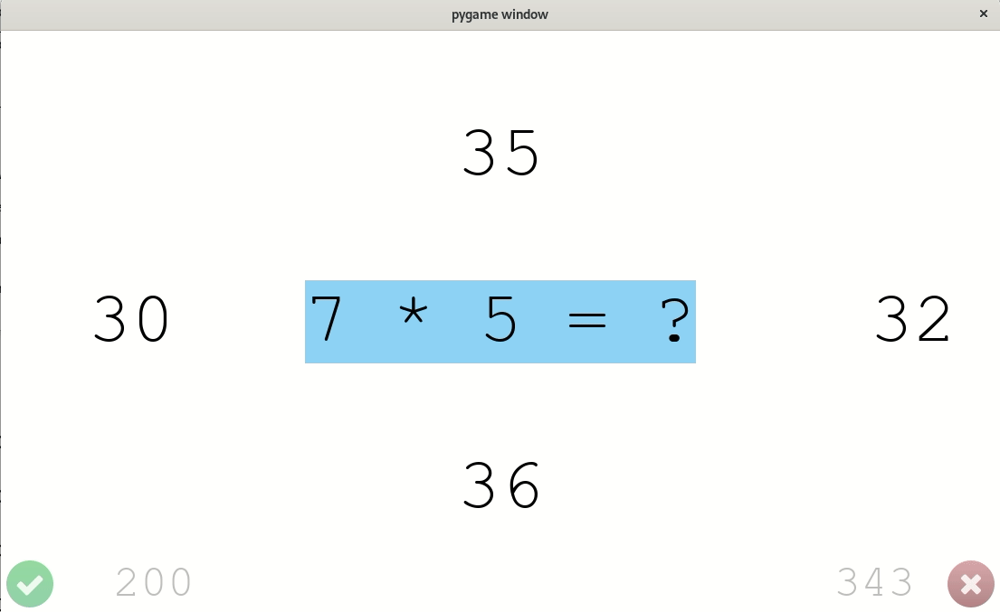

# Tabliczka

An application for learning multiplication table.

## How does it work?

### Basic Operation

The application selects a question from a 10x10 multiplication table and displays it in the middle of the screen.
It also displays four answers to choose from: below, above and on both sides of the question.
Only one of the answers is correct.

The user needs to select the correct answer by pressing a key corresponding to the position of the answer.
Either the arrow keys or the `A`, `W`, `D`, `S` keys can be used.

The application records the answer, optionally displays feedback (see below) and proceeds to ask the next question.

### Question Selection

The assumption is that a user is more likely to answer a question quickly and correctly if he or the has memorized it.
The application keeps track of how quickly the user responded to each question, and whether the answer was correct.
Based on this data, it asks the already memorized questions less frequently than those that have not yet been mastered.

This helps maximize the effectiveness of the time spent on using the application, compared to asking random questions.

### Answer Selection

Generating completely random answers to choose from would make it trivial to select the correct one.
Therefore to require some intellectual effort, the answers are generated in a special way.
Currently they are selected from the answers present in a 3x3 square visually surrounding the given answer on the multiplication table.

## Optional Features

### Showing Feedback

By default the application provides feedback on **incorrect** answers.
The application will briefly pause, highlighting the correct and incorrect answers using green and red background.
Pass the `--no-show-feedback` option to disable providing feedback.

### Showing Scores

By default the application displays the total number of correct and incorrect answers.
They are displayed in the lower corners of the main window.
Pass the `--no-show-scores` option to hide scores.

Use the`--score-font` option to select the font to use for displaying scores.

### Limiting the Number of Questions

By default the application will keep asking questions until it is closed.
Pass the `--limit N` option to exit once `N` questions have been answered correctly.

### Showing Saved State

Pass the `--dump` option to show the internal state in text format and exit.

## Name

"Tabliczka" means "table" (as in "multiplication table") in Polish.

## Authors and Copyright

This application was developed by [Marcin Owsiany](https://github.com/porridge/), using work from others.
See [COPYRIGHT.txt](COPYRIGHT.txt) for detailed copyright and license information.
